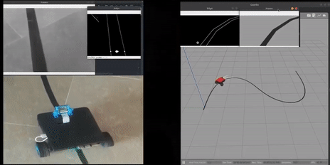

# 🤖 ROS2 Raspberry Pi Intelligent Vision Robot

> A 2-wheel differential drive robot with a caster, powered by Raspberry Pi 4 and ROS2 — built from 3D printed parts with computer vision capabilities.

---

## 📖 About This Repository

This project is all about building a **2-wheel differential drive robot with a caster** from scratch — yes, including the *3D printed chassis*. Every electronic component is documented so you know exactly what plugs where and why.

The **Raspberry Pi 4** sits at the heart of this robot, running *ROS2 Humble* and communicating wirelessly with your laptop over WiFi. No cables, no hassle — just a clean robot you can drive, tune, and hack from your desk.

On the vision side, we go beyond just "making the camera work" — we dig into **bandwidth optimization** and efficient image transmission so your computer vision pipelines actually run smoothly on embedded hardware.

---

## 🚀 Getting Started

Follow these steps to get the repo up and running in your ROS2 workspace.

### 1. Go to your workspace `src` folder

```bash
cd path/to/ros2_ws/src/
# e.g. cd ~/ros2_ws/src/
```

### 2. Clone the repo

```bash
git clone https://github.com/dd8796/intelligent_Vision_Robot
```

### 3. Build with colcon

```bash
cd /path/to/workspace_root/
# e.g. ~/ros2_ws/
colcon build
```

### 4. Source your workspace

Do this in **every new terminal** you open to use packages from this workspace:

```bash
source /path/to/ros2_ws/install/setup.bash
```

### 5. ⚡ Power user tip — auto-source on startup

Tired of sourcing manually? Add it to your `.bashrc`:

```bash
echo "source ~/ros2_ws/install/setup.bash" >> ~/.bashrc
```

> ⚠️ **Run this only once.** It writes directly into your `~/.bashrc` — running it multiple times will add duplicate lines. Only do this if you're comfortable with what that means.

---

## ✨ Features

### 🕹️ Robot Controller Driving

Manual teleoperation and controller-based driving of the differential drive robot.
* **Robot Controller Driving**
  - 


### 〰️ Line Following Robot (Computer Vision)

Vision-based line following using a camera and image processing pipeline.
* **Robot Line Following**


---

## 🛠️ Hardware Overview

| Component | Details |
|-----------|---------|
| Main Computer | Raspberry Pi 4 |
| Drive System | 2-wheel differential drive + caster |
| Chassis | 3D printed parts |
| Communication | WiFi (Laptop ↔ RPi) |
| ROS2 Versions | Foxy & Humble |

---

## 📡 Communication & Vision

WiFi-based communication is used between the development laptop and the Raspberry Pi. The repository includes optimized pipelines for:

- Real-time image data transmission
- Bandwidth optimization for low-latency computer vision tasks

---

## 📄 License

See [LICENSE](LICENSE) for details.
